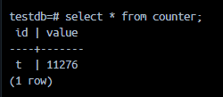
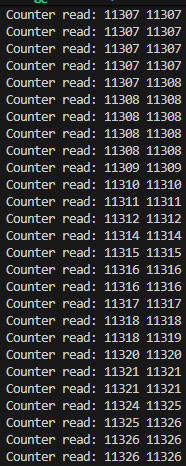

# transaction isolation

A set of experiments to test how PostgreSQL(PG) handles transaction isolation

From PostgreSQL docs (https://www.postgresql.org/docs/17/transaction-iso.html):

|Isolation Level|Dirty Read|Nonrepeatable Read|Phantom Read|Serialization Anomaly|
|---|---|---|---|---|
|Read uncommitted|Allowed, but not in PG|Possible|Possible|Possible|
|Read committed|Not possible|Possible|Possible|Possible|
|Repeatable read|Not possible|Not possible|Allowed, but not in PG|Possible|
|Serializable|Not possible|Not possible|Not possible|Not possible|

## Counter Example
In this example, concurrent reads and writes transactions operate on a single numeric value

- The write transaction atomically increments the counter
- The read transaction atomically reads twice from the counter

Under `Read commited` isolation, the read transaction can return two different values, since the write transaction could have commited between the two reads
- Since the value being read is already commited by the write transaction, this is allowed under `Read commited`, but often undesirable
- This phenomenon is called *read skew*

**Result of counter experiment using `Read commited`**:

As observed, some read transactions can return different values

Using `Repeatable read` (also called `snapshot isolation`) solves this issue by using a historic snapshot of the items read during the read transaction